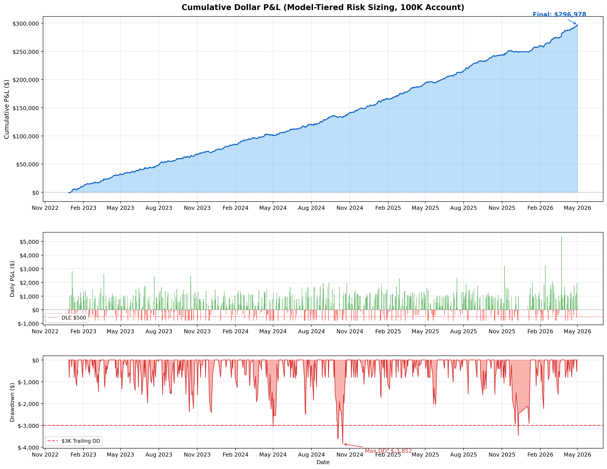
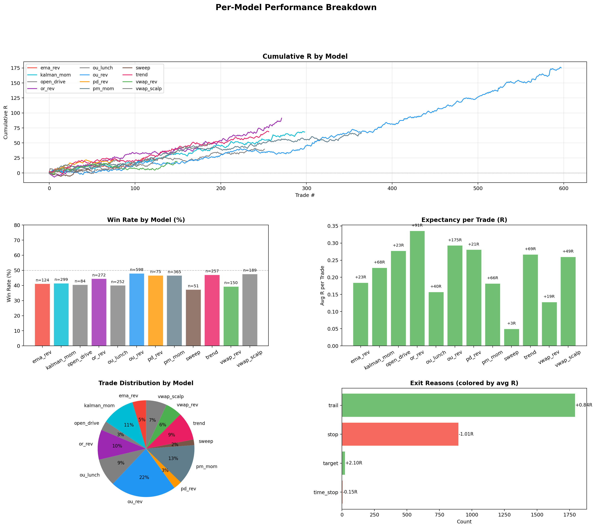
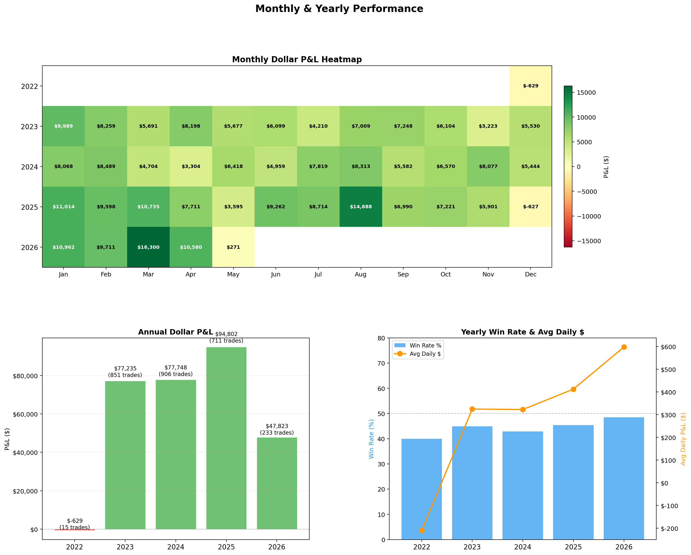
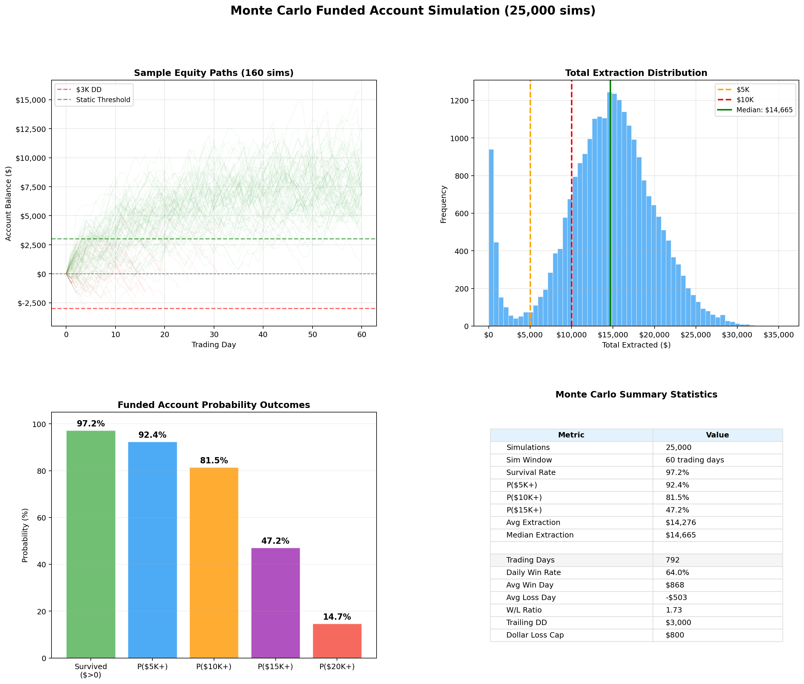
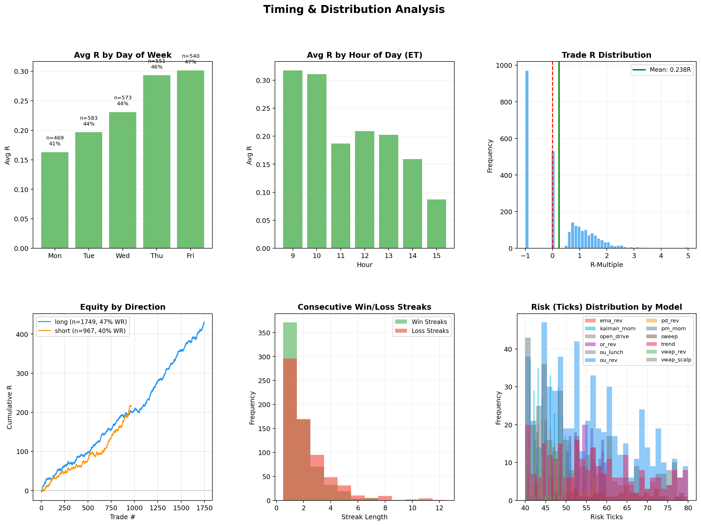
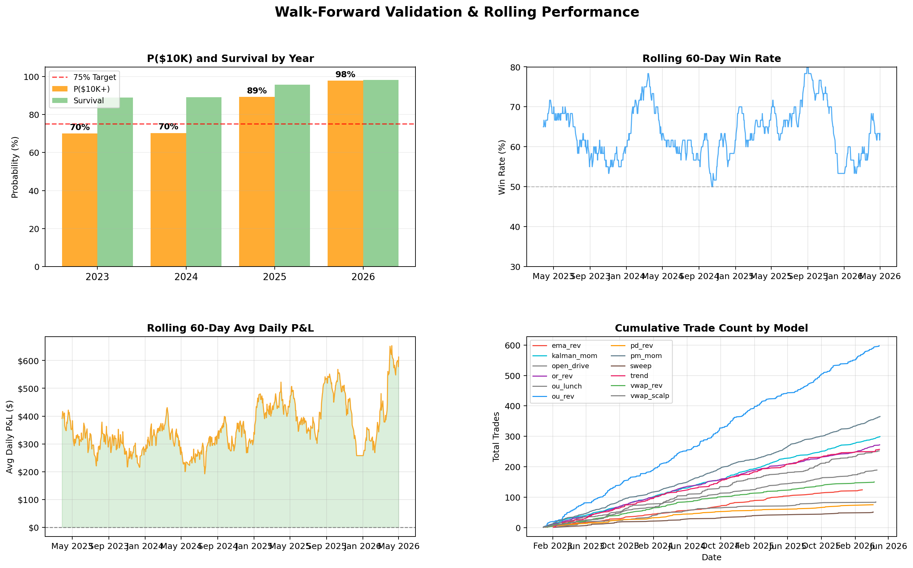

<p align="center">
  <h1 align="center">NQ-ES Trader</h1>
  <p align="center">
    Autonomous MNQ futures trading system for TopStepX 100K funded accounts.<br>
    12 quantitative models. Model-tiered risk. Monte Carlo validated.
  </p>
</p>

<p align="center">
  
  
  
  
</p>

---

## What This Does

This system trades MNQ (Micro E-mini Nasdaq) futures on TopStepX 100K funded accounts. It runs 12 independent quantitative models during regular trading hours, each generating signals based on different market conditions. All models share identical exit mechanics, and a priority-based conflict resolver ensures only one trade is active at a time.

**Backtest and live execution use the exact same config.** What you see in the charts is what runs on your account.

---

## Performance

### Funded Account Simulation

| Metric | Value |
|:--|--:|
| Eval Pass Rate (Monte Carlo) | **89.4%** |
| Median Days to Pass Eval | **7** |
| P($10K payout in 60 days) | **89.0%** |
| Survival Rate | **92.9%** |
| Avg Extraction | **$12,872** |

### Backtest Results (2022-2026)

| Metric | Value |
|:--|--:|
| Total Trades | 2,468 |
| Trading Days | 789 |
| Trades/Day | 3.1 |
| Win Rate | 40.9% |
| Profit Factor | 1.89 |
| Expectancy | +0.36R per trade |
| Total R | +887R |
| Avg Win / Avg Loss | +1.87R / -0.69R |

### Walk-Forward Validation

Each year tested out-of-sample using only data from that year:

| Year | P($10K) | Survival | Avg Extraction |
|:--|--:|--:|--:|
| 2023 | 84.8% | 85.6% | $11,979 |
| 2024 | 84.4% | 84.7% | $12,177 |
| 2025 | 91.1% | 91.1% | $13,680 |
| 2026 | 96.0% | 96.2% | $13,441 |

---

## Charts

| | |
|:--:|:--:|
|  |  |
| Equity Curve and Drawdown | Per-Model Performance |
|  |  |
| Monthly and Yearly Returns | Monte Carlo Funded Simulation |
|  |  |
| Timing and Distribution | Walk-Forward Validation |

---

## Setup

### Prerequisites

- Python 3.10 or higher
- Git
- A terminal (Terminal on Mac, Command Prompt or PowerShell on Windows)

### 1. Install Python

**Mac:**
```bash
brew install python
```

**Windows:**
Download from [python.org/downloads](https://www.python.org/downloads/). During installation, check **"Add Python to PATH"**.

Verify it works:
```bash
python3 --version   # Mac/Linux
python --version    # Windows
```

### 2. Clone the Repo

```bash
git clone https://github.com/s-k-28/nq-es-trader-5k-payout.git
cd nq-es-trader-5k-payout
```

### 3. Install Dependencies

```bash
# Mac/Linux
pip3 install -r requirements.txt

# Windows
pip install -r requirements.txt
```

This installs: `pandas`, `numpy`, `matplotlib`, `tabulate`, `requests`, `python-dotenv`.

If `pip3` gives a permission error, try:
```bash
pip3 install --user -r requirements.txt
```

### 4. Verify Installation

```bash
# Mac/Linux
python3 -c "from config import Config; print('Setup OK')"

# Windows
python -c "from config import Config; print('Setup OK')"
```

If you see `Setup OK`, you're ready.

---

## Running the Backtest

This runs the full 12-model backtest on 2022-2026 data. No broker account needed.

```bash
# Mac/Linux
python3 scripts/generate_charts.py

# Windows
python scripts/generate_charts.py
```

This takes 1-2 minutes and produces:
- 6 chart PNGs saved to `output/charts/`
- 25,000-run eval pass Monte Carlo simulation
- 25,000-run funded account Monte Carlo simulation
- Full summary with per-model breakdown printed to your terminal

You can also run a quick backtest without charts:
```bash
# Mac/Linux
python3 run_multi.py --nq data/Dataset_NQ_1min_2022_2025.csv

# Windows
python run_multi.py --nq data/Dataset_NQ_1min_2022_2025.csv
```

To backtest on 2026 data (with historical warmup):
```bash
python3 run_multi.py --nq data/mnq_2026_1min.csv --history data/Dataset_NQ_1min_2022_2025.csv
```

---

## Launching the Dashboard

```bash
# Mac/Linux
python3 frontend/server.py

# Windows
python frontend/server.py
```

Open **http://localhost:8080** in your browser. The dashboard has four tabs:

| Tab | What It Shows |
|:--|:--|
| **Interactive Charts** | Equity curve, per-model equity, monthly P&L, win rates, R distribution, day-of-week and hour analysis. Filter by time period and toggle individual models on/off. |
| **Deep Analysis** | Pre-rendered matplotlib charts: equity/drawdown, model breakdown, monthly heatmap, timing analysis, walk-forward validation. |
| **Monte Carlo** | Eval pass rate simulation, funded account simulation, probability outcomes across 25,000 runs. |
| **Strategy Rules** | Complete reference for all 12 models, exit mechanics, risk sizing, daily controls, and TopStepX account rules. |

To stop the dashboard: press `Ctrl+C` in the terminal.

---

## Connecting to TopStepX (Live Trading)

You need a TopStepX account to trade live or paper trade. The backtest and dashboard work without one.

### Step 1. Get Your API Credentials

1. Log in at [topstepx.com](https://topstepx.com)
2. Go to **API Access** in your account dashboard
3. Copy your **username** and **API key**

### Step 2. Create Your .env File

```bash
cp .env.example .env
```

Open `.env` in any text editor and fill in your credentials:

```env
TOPSTEP_USER=your_topstep_username
TOPSTEP_API_KEY=your_api_key
TOPSTEP_ENV=demo
```

| Variable | What to Enter |
|:--|:--|
| `TOPSTEP_USER` | Your TopStepX login username |
| `TOPSTEP_API_KEY` | The API key from your TopStepX dashboard |
| `TOPSTEP_ENV` | `demo` for paper trading, `live` for real funded account |

### Step 3. Run in Demo Mode First

Always start with demo to verify the connection works:

```bash
# Mac/Linux
python3 run_live.py

# Windows
python run_live.py
```

You should see:
```
+============================================================+
|          NQ TRADING BOT -- TOPSTEP 100K XFA                 |
+============================================================+
|  Models:     12 (OU, PD, VWAP, OR, OU-Lunch, VWAP-Scalp,   |
|              Open-Drive, Trend, PM Mom, EMA, Kalman, Sweep)  |
|  Mode:       DEMO                                           |
|  Risk tiers: OU $2,500 | PD $900 | rest $400               |
|  Daily:      Win cap 2.0R | DLC $1,000 | CC 10             |
|  Payouts:    $5K max, 30% bal, 5 green days ($150+)         |
+============================================================+
```

### Step 4. Go Live

Once demo mode works:

```bash
# Mac/Linux
python3 run_live.py --env live

# Windows
python run_live.py --env live
```

The bot will:
1. Authenticate with TopStepX via REST API
2. Load ~83 days of 1-minute history for regime warmup
3. Auto-detect the current front-month MNQ contract
4. Begin trading all 12 models autonomously

**To stop the bot:** Press `Ctrl+C`. This flattens all open positions and cancels pending orders before exiting.

### Troubleshooting

| Problem | Solution |
|:--|:--|
| `ModuleNotFoundError: No module named 'pandas'` | Run `pip3 install -r requirements.txt` (or `pip install` on Windows) |
| `ERROR: Missing credentials` | Make sure `.env` exists and has `TOPSTEP_USER` and `TOPSTEP_API_KEY` filled in |
| `Connection failed: Auth failed` | Your username or API key is incorrect. Re-check them on the TopStepX dashboard |
| `Contract not found` | The bot auto-detects the front-month MNQ contract. If this fails, the quarterly rollover may be in progress -- wait for the new contract to activate |
| `No active accounts found` | Your TopStepX account may be inactive or expired. Check your account status on the TopStepX dashboard |
| `pip3: command not found` | Try `pip` instead of `pip3`, or `python3 -m pip install -r requirements.txt` |
| `Permission denied` on Mac | Add `--user` flag: `pip3 install --user -r requirements.txt` |

---

## Strategy

### 12-Model Architecture

| # | Model | Type | Priority | Risk/Trade | Description |
|:--|:--|:--|--:|--:|:--|
| 1 | OU Reversion | Mean-reversion | 15 | $2,500 | Ornstein-Uhlenbeck on price-VWAP deviation. Trades when half-life is short and Hurst < 0.45. Quality-filtered (Q >= 4). |
| 2 | OU Lunch Zone | Mean-reversion | 16 | $400 | Dedicated lunch-window OU fade. Uses tighter z-score and Hurst filters during 11:30-13:30 ET. |
| 3 | PD Level Reversion | Mean-reversion | 22 | $900 | Fades at previous day high/low with reversal candle confirmation. |
| 4 | VWAP Reversion | Mean-reversion | 25 | $400 | Bidirectional VWAP standard-deviation fade. Targets snap-back to session VWAP. |
| 5 | VWAP Band Scalper | Mean-reversion | 25 | $400 | Faster VWAP/OU band fade with partial move-to-VWAP target and shorter time stop. |
| 6 | Opening Range Rev | Mean-reversion | 28 | $400 | Fades extended moves beyond first 15 min of RTH back to OR midpoint. Window: 10:00-12:00 ET. |
| 7 | EMA Reversion | Mean-reversion | 30 | $400 | Fades when price extends 2.5+ standard deviations from 20-period EMA. Window: 9:50-14:30 ET. |
| 8 | Sweep Reversal | Mean-reversion | 35 | $400 | Liquidity sweep at PDH/PDL/session extremes followed by immediate reversal. Detects stop hunts. |
| 9 | Opening Drive | Momentum | 12 | $400 | Trades early RTH drive pullbacks toward VWAP after a strong 9:30-9:35 push. |
| 10 | Kalman Momentum | Momentum | 40 | $400 | Trades Kalman filter slope direction when Hurst >= 0.5. Requires 5-bar slope consistency. Window: 10:15-14:00 ET. |
| 11 | Trend Continuation | Momentum | 40 | $400 | Follows EMA/regime trends with pullback entries. |
| 12 | PM Momentum | Momentum | 50 | $400 | Afternoon session Kalman slope pullback model. Window: 13:30-15:00 ET. |

### Per-Model Results

| Model | Trades | Win Rate | Expectancy | Total R |
|:--|--:|--:|--:|--:|
| ou_rev | 424 | 47% | +0.576R | +244.0R |
| vwap_rev | 246 | 39% | +0.618R | +152.1R |
| or_rev | 270 | 38% | +0.402R | +108.7R |
| trend | 334 | 45% | +0.278R | +92.8R |
| kalman_mom | 446 | 34% | +0.197R | +87.8R |
| pm_mom | 390 | 41% | +0.224R | +87.2R |
| ema_rev | 231 | 38% | +0.287R | +66.4R |
| pd_rev | 88 | 51% | +0.478R | +42.0R |
| sweep | 39 | 41% | +0.160R | +6.2R |

### Signal Flow

```
1-min bars --> compute_vwap() + compute_opening_range()
          --> compute_all_quant_features() (OU, Hurst, Kalman, Parkinson, BB)
          --> 12 models generate signals independently
          --> filter: cut off after 3:30 PM ET
          --> resolve conflicts: 3-bar cooldown, priority-based (lower # wins)
          --> quality filter: OU needs Q >= 4, all others pass through
          --> engine: simulate trades with BE / trail / time-stop
```

### Quantitative Features

All computed in `strategy/quant/features.py`:

| Feature | Method | Window |
|:--|:--|--:|
| Ornstein-Uhlenbeck | Rolling OLS on price-VWAP deviation. Estimates mean-reversion speed, half-life, and z-score. | 60 bars |
| Hurst Exponent | Variance-ratio method (16-bar vs 1-bar returns). H < 0.45 = mean-reverting, H > 0.55 = trending. | 120 bars |
| Kalman Filter | 2x2 state-space model estimating level + slope. Inline matrix math for speed on 1M+ bars. | Rolling |
| Parkinson Volatility | High-low range estimator, more efficient than close-to-close. | 30 bars |
| Bollinger Band Squeeze | BBW percentile for volatility expansion detection. | 20 bars |

---

## Exit Mechanics

All 12 models use the same exit profile:

| Parameter | Value | What It Does |
|:--|:--|:--|
| Partial profit | 0.0 | No partial-taking. Winners run to full target or trail exit. |
| Trail | 0.001 | Once MFE >= 0.5R, trailing stop activates 0.1% behind max favorable excursion. Trail IS the exit. |
| Breakeven | 0.6R | Stop moves to entry once trade moves 0.6x risk in your favor. Trade becomes risk-free. |
| Time stop | 30-45 min | Closes at market if trade has not hit breakeven within the model's time limit. |
| Session close | 4:59 PM ET | Flatten everything. No overnight positions. |

---

## Daily Controls

| Control | Value | What It Does |
|:--|:--|:--|
| Daily win cap | 2.0R | Stop taking signals once daily R reaches +2.0. Protects a good day. |
| Max daily loss R | No limit | Allows intraday recovery. A -1R trade can be followed by a +3R winner. |
| Dollar loss cap | $1,000 | Daily P&L truncated at -$1,000. Hard protection matching TopStepX rule. |
| Consecutive cooldown | 10 | After 10 straight losses, skip next signal. Circuit breaker. |
| Max concurrent | 1 | One trade at a time. No overlapping positions. |

---

## Risk Sizing

Model-tiered dollar risk per trade:

| Tier | Models | Risk/Trade | Rationale |
|:--|:--|--:|:--|
| High | ou_rev | $2,500 | Highest edge (47% WR, +0.576R), quality-filtered |
| Medium | pd_rev | $900 | High WR (51%), strong at institutional levels |
| Standard | All other models | $400 | Diversified coverage across market conditions |

**Contract formula:**

```
contracts = min(20, floor(risk_dollars / (risk_ticks * $0.50)))
```

Examples:
- OU signal with 40 ticks risk: floor($2,500 / (40 x $0.50)) = 125, capped at **20 MNQ**
- Kalman signal with 40 ticks risk: floor($400 / (40 x $0.50)) = **20 MNQ**

---

## TopStepX 100K Account Rules

### Evaluation Phase

You must pass the eval before receiving a funded account.

| Rule | Value |
|:--|:--|
| Profit target | $6,000 |
| Trailing drawdown | $3,000 |
| Static floor | None (DD trails from peak at all times) |
| Time limit | None (trade until you hit $6K or blow the $3K DD) |

**Monte Carlo result:** 89.4% pass rate across 25,000 simulations. Median 7 trading days to pass, 90th percentile 13 days.

### Funded Account Phase

Once you pass the eval, the funded account has different rules:

| Rule | Value |
|:--|:--|
| Starting balance | $100,000 |
| Trailing drawdown | $3,000 (trails upward with profit) |
| Static floor | Locks at $0 P&L when peak profit reaches $3,000 |
| Dollar loss cap | $1,000 per day |
| Max payout | $5,000 per withdrawal |
| Payout cap | 30% of current balance |
| Green day minimum | $150 profit |
| Green days per payout | 5 |
| Post-static scaling | 1.25x P&L when balance > $3K above start |

### How Payouts Work

1. **Build to $3K peak** -- Trade until your peak profit hits $3,000. At this point, the drawdown floor locks at $0 (static phase).
2. **Accumulate green days** -- Every day you make $150+ profit counts as a green day. You need 5 green days per payout.
3. **Withdraw** -- After 5 green days, withdraw up to $5,000 (or 30% of your current balance, whichever is less).
4. **Repeat** -- Keep trading and withdrawing. The floor stays locked at $0 so you cannot lose the account unless balance drops to $100,000.

Monte Carlo result: 89% of 25,000 simulations extract $10K+ in 60 trading days.

---

## Backtest on Custom Data

```bash
python run_multi.py --nq data/Dataset_NQ_1min_2022_2025.csv
```

With separate historical data for regime warmup:

```bash
python run_multi.py --nq data/mnq_2026_1min.csv --history data/Dataset_NQ_1min_2022_2025.csv
```

| Flag | Description |
|:--|:--|
| `--nq` | Path to 1-minute NQ/MNQ CSV file (required) |
| `--history` | Historical data to prepend for regime warmup (auto-detected for 2026+ data) |
| `--nq-daily` | Optional pre-built daily bars CSV |
| `--es` | Optional ES data for cross-market features |
| `--account` | Starting account size (default: $100,000) |
| `--risk` | Risk multiplier (default: 1.0) |
| `--csv` | Export trades to CSV file |
| `--plot` | Save equity curve chart to file |

---

## Project Structure

```
nq-es-trader/
  config.py                        All parameters: strategy, risk, funded account rules
  run_live.py                      Live bot entry point (TopStepX 100K)
  run_multi.py                     Backtest runner with per-model reporting

  strategy/
    multi.py                       Signal orchestrator: generate, filter, resolve conflicts
    quality.py                     OU quality scoring (Q >= 4 filter)
    vwap.py                        Session VWAP + 15-min opening range
    quant/
      features.py                  OU, Hurst, Kalman, Parkinson, BB squeeze
    models/
      __init__.py                  ALL_MODELS registry (12 models)
      base.py                      BaseModel, Signal, ModelRiskProfile dataclasses
      ou_reversion.py              OU mean-reversion (priority 15, $2,500)
      pd_level_reversion.py        Previous day level fade (priority 22, $900)
      vwap_reversion.py            VWAP z-score reversion (priority 25)
      ou_lunch.py                  Lunch-session OU reversion (priority 16)
      vwap_scalper.py              Faster VWAP band scalper (priority 25)
      opening_drive.py             Opening drive momentum (priority 12)
      or_reversion.py              Opening range reversion (priority 28)
      ema_reversion.py             EMA mean-reversion (priority 30)
      sweep_reversal.py            Liquidity sweep reversal (priority 35)
      kalman_momentum.py           Kalman filter momentum (priority 40)
      trend_cont.py                Trend continuation with FVG (priority 40)
      afternoon_momentum.py        PM session momentum (priority 50)

  backtest/
    engine_v2.py                   Backtester: trail, BE, partials, time stops, win cap
    funded_sim.py                  Eval pass + funded account Monte Carlo simulators
    metrics_v2.py                  Trade metrics, per-model breakdown

  data/
    loader.py                      CSV loader, resampler, daily bar builder
    Dataset_NQ_1min_2022_2025.csv  NQ 1-min data (2022-2025)
    mnq_2026_1min.csv              MNQ 1-min data (2026)

  live/
    broker_topstep.py              TopStepX REST API: auth, orders, positions, bars
    executor_multi.py              Live executor: model-tiered sizing, same config as backtest

  frontend/
    index.html                     Interactive dashboard (4 tabs, Chart.js)
    server.py                      Dashboard server (trade API + chart images)

  scripts/
    generate_charts.py             Full backtest + eval MC + funded MC + 6 chart PNGs
    run_optimization.py            Automated P($10K) parameter optimization
    sim_topstep50k.py              TopStep 50K account simulation
    fetch_data.py                  Data fetching utilities
    show_daily.py                  Daily P&L viewer
    show_payout_timeline.py        Payout timeline projections

  output/
    charts/                        Generated chart PNGs (6 files)
    trades/                        Backtest and live trade CSVs

  docs/
    SETUP_MAC.md                   Mac setup guide
    optimization_log.md            Parameter optimization history

  launchers/
    start_bot.command              Mac double-click launcher
    start_bot.bat                  Windows double-click launcher

  tests/
    conftest.py                    Test fixtures
    test_live_robustness.py        Live execution robustness tests

  deploy/
    setup.sh                       Server setup script
    deploy.sh                      Deployment script
    hub/                           Monitoring hub server

  cloud/
    README_CLOUD.md                Cloud deployment guide
    setup_oracle.sh                Oracle Cloud setup
```

---

<p align="center">
  Built for TopStepX 100K funded accounts.
</p>
